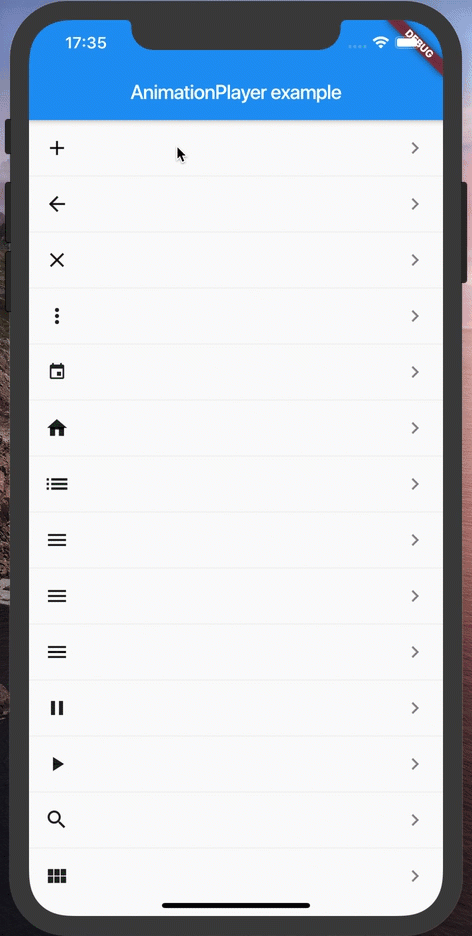

# animation_player



Animation player.

## Usage

```dart
AnimationPlayer(
  builder: (context, animation) {
    // return Animated Widget like this:
    return AnimatedIcon(
      size: targetSize,
      icon: iconData,
      progress: animation,
    );
  },
),
```

## Example

- https://github.com/mono0926/animation_player/tree/master/example
